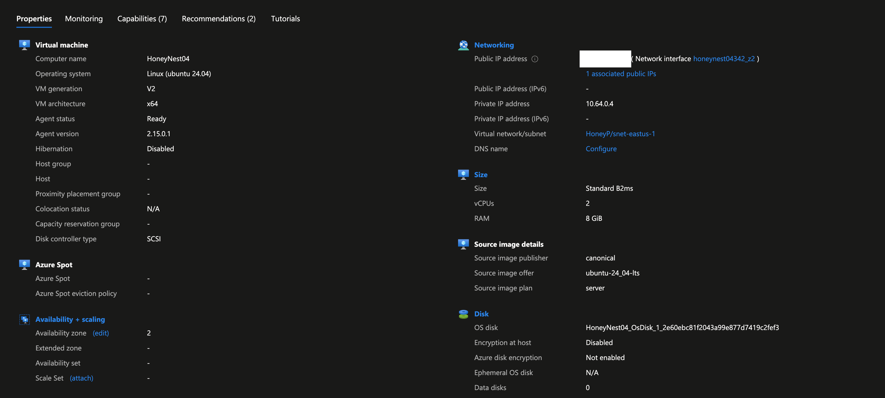
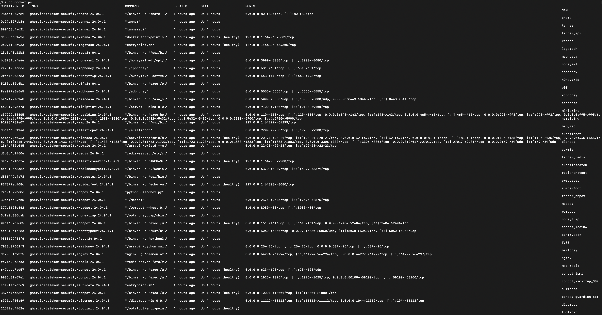
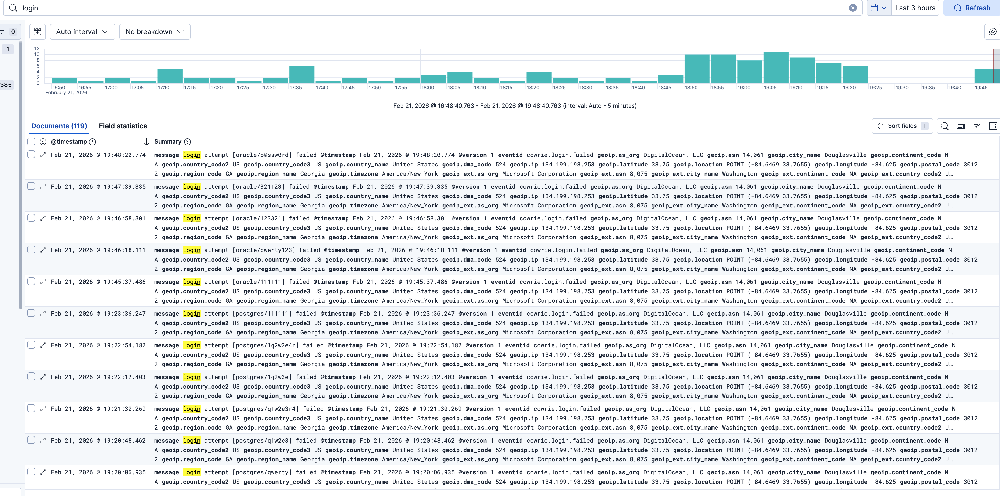
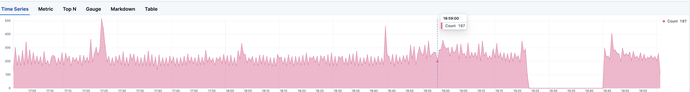
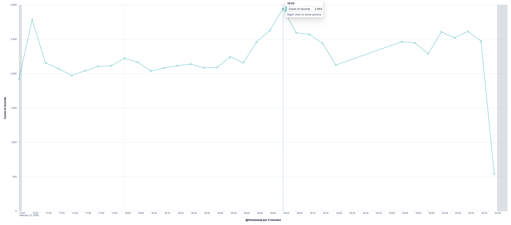
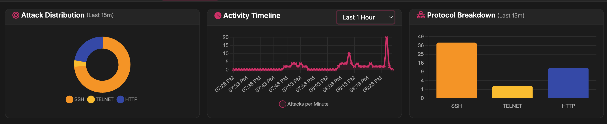

# Cloud Honeypot Threat Intelligence Lab (Azure + T-Pot)

This project documents the deployment of a cloud-based honeypot in **Microsoft Azure** using **T-Pot** to capture real-world attack telemetry, analyze adversary behavior, and build visual dashboards. The goal is to understand how internet facing systems are scanned/attacked and to practice practical query skills used by security engineers.

---

## Architecture

High-level architecture showing an Azure-hosted T-Pot honeypot exposed to the internet with controlled ingress/egress and centralized logging via the Elastic Stack.

---

## Deployment Summary (High Level)

- Deployed an Ubuntu Linux VM in Azure with a public IP
- Installed and configured **T-Pot** (honeypots + Elastic Stack)
- Exposed honeypot services to the internet for observation
- Restricted management access to trusted IPs only
- Implemented isolation and egress controls to reduce abuse risk

Deployment of Linux VM

Verifying T-Pot Installed & Configured

Network Firewall Rules (Shows what ports are exposed to internet)

---

## Telemetry Collected

- Source IP addresses (attack origin)
- Username/password attempts (brute force patterns)
- Session activity and timestamps
- Post-authentication command attempts (attacker behavior)
- Frequency trends over time (spikes and scanning waves)

Source IP addresses in Kibana

Brute Force Attempts

Frequency Trends

---

## Dashboards & Screenshots

### Kibana Overview (Visualization focuses on authentication-based attack traffic)

### Top Attacking Source IPs

### SSH Brute Force / Credential Attempts

---
Conclusion 

I enjoyed creating a honeypot and getting able to see what it is like to host something where you openly allow the internet to in theory penterate test what you have setup to either monitor or gain insight on what attacks hacker may try to get access. Being able to see the different countries that attackers are from is when reading the logs shows me that threat actors from all places not just where you are located or general area. Being able to deal with understanding query language  and go through the logs was insightful as it allowed me to go through information in a different way and even locate items faster based on how you query the search. 
