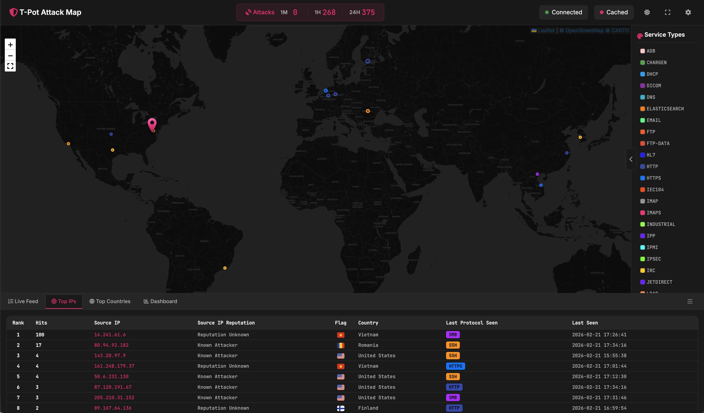
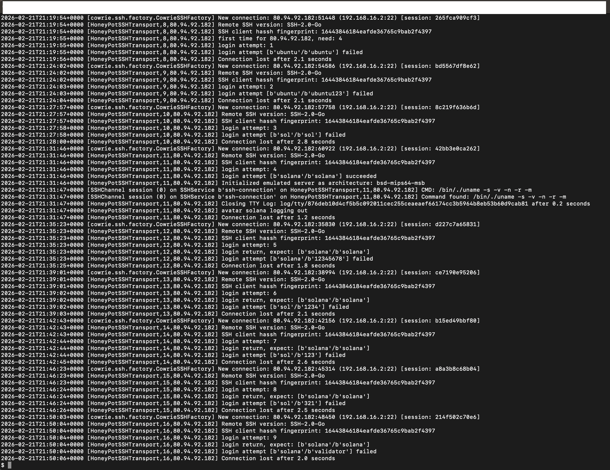

# Cloud Honeypot Threat Intelligence Lab (Azure + T-Pot)

This project documents the deployment of a cloud-based honeypot in **Microsoft Azure** using **T-Pot** to capture real-world attack telemetry, analyze adversary behavior, and build visual dashboards. The goal is to understand how internet facing systems are scanned/attacked and to practice practical query skills used by security engineers.

---

## Architecture


High-level architecture showing an Azure-hosted T-Pot honeypot exposed to the internet with controlled ingress/egress and centralized logging via the Elastic Stack.

---

## Deployment Summary (High Level)

- Deployed an Ubuntu Linux VM in Azure with a public IP
- Installed and configured **T-Pot** (honeypots + Elastic Stack)
- Exposed honeypot services to the internet for observation
- Restricted management access to trusted IPs only
- Implemented isolation and egress controls to reduce abuse risk

---

## Telemetry Collected

- Source IP addresses (attack origin)
- Username/password attempts (brute force patterns)
- Session activity and timestamps
- Post-authentication command attempts (attacker behavior)
- Frequency trends over time (spikes and scanning waves)

---

## Dashboards & Screenshots

### Kibana Overview


### Top Attacking Source IPs


### SSH Brute Force / Credential Attempts


---

## Query Examples (Day-to-Day Filtering)

### Kibana (KQL-style filters)
Use these to quickly slice the dataset:

```text
event.dataset : "cowrie*"
destination.port : 22
source.ip : "x.x.x.x"
